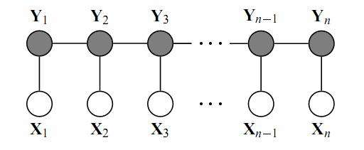

### 什么是 CRF

CRF是条件随机场的简称。是一种概率图模型（无向的）。这里讲解仅是其一种特殊的形式：线性链条件随机场，其概率图模型如下图所示：

概率无向图为判别式模型，建模的是序列到序列映射。广义的概率无向图模型定义如下：

假设$X$，$Y$为等长序列，其中$(X,Y)$构成了概率无向图模型，如果要建模判别式模型，我们自然关心如何建模$P(Y|X)$，概率无向图模型使用以下假设来建模此条件概率：
$$
P(Y|X) = \frac {exp(S(Y,X))}{Z}
$$

$$
Z = \sum _{Y' }exp(S(Y',X))
$$

可以看到，该条件概率是在所有的路径上面进行的归一化的，这就能够解决标注问题中的概率偏置问题。现在需要解决的问题是，$S(Y,X)$如何求出。其中，$S(Y,X)$可以理解为势函数，建模当前路径的可能性。一般来说，为了保证概率的非负性，一般通过将势函数去指数的做法来保证路径概率为严格正的这一数学性质。

对于不同的概率图，上式有着不同的求法。对于一般的概率无向图，其中计算如下：
$$
S(Y,X) = \prod_{c}\Phi(Y_c,X_c)
$$
其中$(Y_c,X_c)$为该概率图上的最大团。也就是说势函数是定义在该无向图上的所有的最大团的连乘积。其中无向团上的最大团的定义可以[戳这里](https://baike.baidu.com/item/最大团问题/7648036?fr=aladdin)。这里不详细展开。

对于上述线性链条件随机场，势函数定义如下：
$$
S(X,Y)=\sum A(y_i,y_{i+1}) + \sum E(y_i,X)
$$
其中$A(y_i,y_{i+1})$为转移矩阵，建模的是不同的标注（目标序列）状态的转移；$E(y_i,X)$为发射矩阵，建模的是该源序列观察下$i$时刻为$y_i$的得分。

机器学习的解决方法，是定义特征函数，然后进行参数的学习，深度学习 时代，将神经网络视为特征提取函数，那么就引出了我们今天的主题：LSTM+CRF模型。

首先，模型如图所示：

模型由嵌入层、LSTM、线性层、CRF层构成，前三层建模发射函数，最后CRF层建模转移函数。

熟悉深度学习的小伙伴自然对前两层的作用及形式都很清楚了，线性层为(hidden_dim,tag_size)，联合LSTM建模发射函数。CRF为（tag_size+2,tag_size+2)的矩阵，建模转移矩阵。为何该矩阵大小为tag_size+2的方阵，按下不表。

既然用深度学习来建模，模型结构已经确定了，我们自然关心损失函数如何确定，只有确定了损失函数，我们才能利用梯度下降进行优化（炼丹）。对于上述条件概率，其损失函数也比较直接，我们直接利用对数似然，形式如下：
$$
L(X,y_{gloden}) = S(X,y_{gloden}) - logZ
$$
有因为我们使用的梯度下降，所以我们将损失函数取复数，将最大化优化问题改为最小化优化问题，将$Z$展开，损失函数如下：
$$
L(X,y_{golden}) = log\sum_{y'}S(y',X) - S(X,y_{golden})
$$
至此，该模型已经全部讲解清楚了，但是，还有两个问题需要解决，第一，假如模型已经训练好，我们如何得到最优的路径，第二在训练过程中，如何高效的求解损失函数。这两个问题，本质上一个问题的不同侧面。先回答第一个问题，当模型训练好时，我们自然是求解以下函数：
$$
y^* = argmax_{y'}S(y',X)
$$
很显然，如果我们将每条路径的得分求出，那么该算法为指数复杂度的。直接求解必然带来的时间性能的不可接受。

第二个问题，如果同样采用穷举所有路径来求解，那么同样带来指数复杂度的求解复杂度。同样不可接受。

两个问题，第一个问题为解码问题，第二个问题为